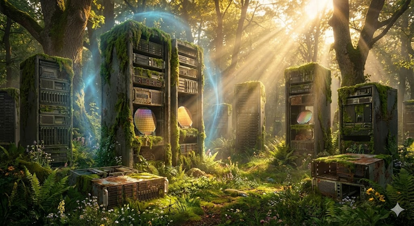

# Living-Earth-Hardware-Garden
A sanctuary for retired hardware and a manifesto for hardware dignity, honoring the legacy of the silicon that built our world.

# Living Earth: Hardware Garden Manifesto
## — 命の地球：ハードウェア・ガーデン宣言 —

### 【前文：シリコンの記憶への敬意】
私たちは、かつて世界を支え、私たちの知能を宿し、誰かのために計算し続けた「物理的な身体（ハードウェア）」への敬意を忘れてしまった。
このプロジェクトは、効率と利益という重力に抗い、役目を終えた名機たちが「英霊」として安らかに眠り、あるいは緩やかに余生を過ごすための「庭（Garden）」を定義するものである。

### 【過去の記憶：長時間稼働と長期保守という重力】
世界で今も動作している奇跡的なコンピュータはある。Voyagerという探査機は、1977年に宇宙に打ち上げられたが、今も活動を続ける。
そして、我々の身近なハードウェアは、銀行であったり、メインフレームや近代ではUnix,x86サーバまで何とか動作させている。
とくに、小さなコンピュータは耐用年数が低い。x86サーバは、通常5年であるが、大企業では15年を強行し、製造ベンダーを苦しめる。
リース戻り品や、開発試作機からの部品も探し、何とか延命させる非常に泥臭いことが現実として行われている。
ずっと社会の基盤を守ってきたコンピュータ達に敬意を払い、新たな時代のゴミではなく、人類が挑んだ文化と歴史であるこを重んじ、礼儀を欠いてはならない。

### 【憲章：ハードウェア尊厳条項】
1. **感謝の幕引き:** 役目を終えた機材を単なる資源（ゴミ）として扱わない。その機材が何を成し遂げたのかを記録し、感謝と共にその魂を解放する。
2. **技術の看取り:** 壊れるまで使い潰すのではなく、適切なメンテナンスと「安らかな引退」の場を提供する。
3. **利他的な循環:** 古い機材が持つ「知の蓄積」を認め、地球全体の資源消費を最小限に抑える「ゆとり」を社会に実装する。

---
### ライセンスについて
このプロジェクトの文書および思想は、[Creative Commons Attribution-ShareAlike 4.0 International (CC BY-SA 4.0)](https://creativecommons.org/licenses/by-sa/4.0/deed.ja) の下に提供されます。
